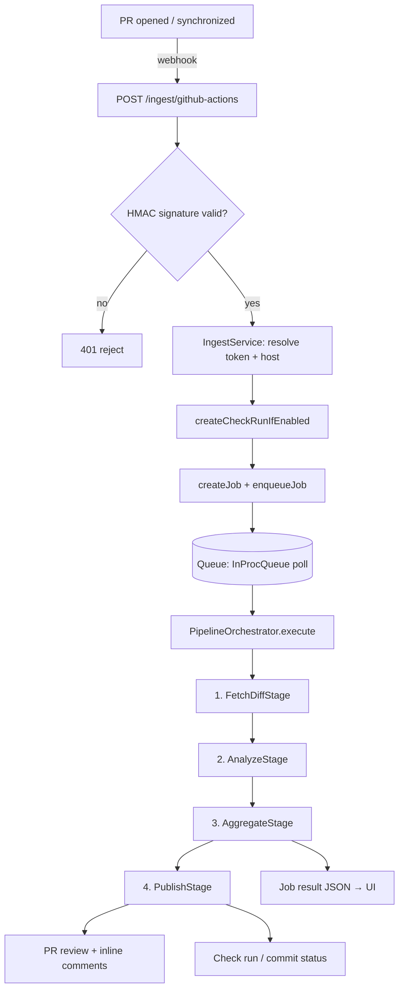
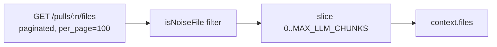
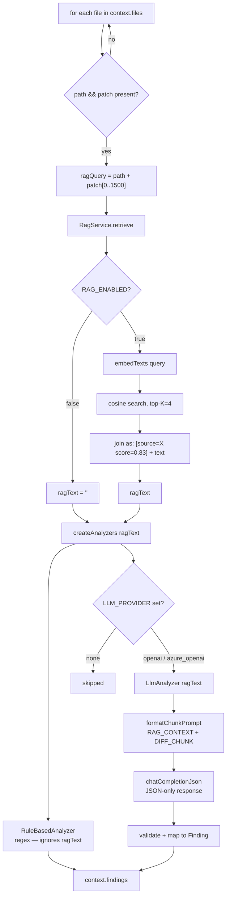
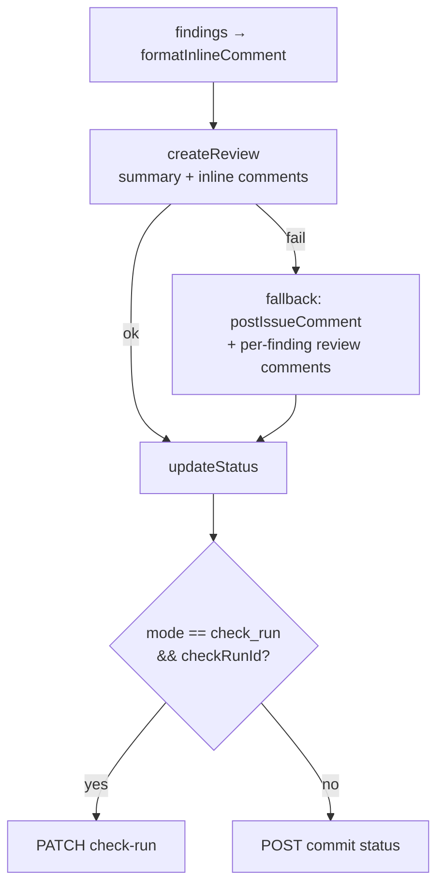
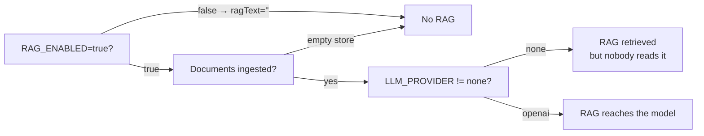
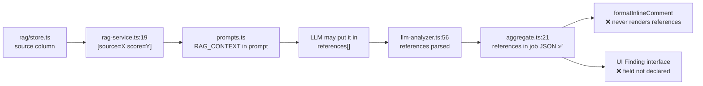

# SecurePR AI — Review Flow

How a pull request actually gets reviewed today, traced through the running code.

## 📖 Table of Contents
1. [Three Quick Answers](#three-quick-answers)
2. [End-to-End Flow](#end-to-end-flow)
3. [Stage 1 — FetchDiffStage](#stage-1--fetchdiffstage)
4. [Stage 2 — AnalyzeStage (where AI + RAG happen)](#stage-2--analyzestage-where-ai--rag-happen)
5. [Stage 3 — AggregateStage](#stage-3--aggregatestage)
6. [Stage 4 — PublishStage](#stage-4--publishstage)
7. [Is RAG Actually Used?](#is-rag-actually-used)
8. [Is the Document Name Shown to the User?](#is-the-document-name-shown-to-the-user)
9. [Configuration Matrix](#configuration-matrix)
10. [Known Gaps](#known-gaps)

---

## Three Quick Answers

**Q1 — How does the AI review the diff now?**
Per changed file, the raw GitHub `patch` (unified-diff text, not the full file) is sent to
the LLM in a single call, together with any retrieved policy excerpts. A regex analyzer runs
alongside it. There is **no chunking** — one file = one LLM call, capped at 5 files.

**Q2 — Is it using the RAG documents?**
The wiring exists and works, but it is **off by default** (`RAG_ENABLED=false`). When enabled,
RAG feeds **only** the LLM analyzer — the rule analyzer never sees it. Also note that without
`OPENAI_API_KEY` the embeddings silently fall back to a hash-based stub, which makes retrieval
effectively meaningless. See [Is RAG Actually Used?](#is-rag-actually-used).

**Q3 — Does the user see which document was used?**
**No.** The source name reaches the LLM prompt as `[source=...]`, and the model is told to cite
it in `references[]`. That array survives into the job JSON, but the PR comment never renders it
and the UI's `Finding` interface does not even declare the field. See
[Is the Document Name Shown to the User?](#is-the-document-name-shown-to-the-user).

---

## End-to-End Flow



Entry point: `services/pipeline/pipeline-v2.ts:processJob` → `orchestrator.ts:16` (stage list).
A stage throwing aborts the whole run with a `PipelineError` (`orchestrator.ts:33`).

---

## Stage 1 — FetchDiffStage

`services/pipeline/stages/fetch-diff.ts`



1. `DiffFetcher.fetchFiles` pages through `GET /repos/:o/:r/pulls/:n/files` (`diff-fetcher.ts:17`).
2. Noise files are dropped **before** the cap (`fetch-diff.ts:38`) so a lockfile diff can't crowd
   out real source changes — `node_modules/`, `dist/`, `build/`, `.next/`, `vendor/`, lockfiles,
   images, fonts, `.map`, `.min.js`, binaries.
3. The survivors are truncated to `MAX_LLM_CHUNKS` (default **5**) files — `fetch-diff.ts:43`.

> ⚠️ The cap is a **file** cap despite the name. File #6 onward is never reviewed, silently.

Each surviving item carries GitHub's `patch` field: unified-diff text with `@@` hunk headers and
`+`/`-` prefixes. **Only changed hunks — never the whole file.** This is the "diff-first" property:
the LLM sees no unchanged surrounding code.

---

## Stage 2 — AnalyzeStage (where AI + RAG happen)

`services/pipeline/stages/analyze.ts` — the core of the review.



### Step by step

| # | What | Where |
|---|---|---|
| 1 | Skip files with no `path` or no `patch` (binary/renames) | `analyze.ts:17` |
| 2 | Build the retrieval query: file path + **first 1500 chars** of the patch | `analyze.ts:22` |
| 3 | Retrieve policy excerpts — wrapped in try/catch, failure ⇒ empty context | `analyze.ts:25` |
| 4 | Build analyzers **per file**, injecting `ragText` | `analyze.ts:31` |
| 5 | Run every analyzer over the same patch, collect findings | `analyze.ts:35` |

### What the LLM actually receives

`RagService.retrieve` (`rag-service.ts:19`) formats each hit as:

```
[source=secure-coding-policy.pdf score=0.831]
<chunk text>

---

[source=owasp-notes.md score=0.774]
<chunk text>
```

That string is spliced into the prompt as `RAG_CONTEXT`, followed by the diff as `DIFF_CHUNK`
(`prompts.ts:13`, `llm-analyzer.ts:24`). The system prompt (`prompts.ts:1`) instructs the model to:

- treat RAG_CONTEXT as **this organization's own** policy excerpts,
- use it as **confirming evidence** when the diff matches something the policy requires/forbids,
- **cite the `[source=...]` id in the finding's `references[]` array**,
- fall back to general secure-coding knowledge when RAG_CONTEXT is empty or irrelevant,
- never fabricate a policy citation, and never emit exploit steps.

The response is parsed as JSON. Findings missing a `title`, `severity`, or a finite
`location.start_line` are dropped with a warning (`llm-analyzer.ts:34`); `file_path` is overwritten
server-side rather than trusted from the model.

### The two analyzers

| | RuleBasedAnalyzer | LlmAnalyzer |
|---|---|---|
| Always on? | Yes (`factory.ts:14`) | Only if `LLM_PROVIDER` is `openai`/`azure_openai` |
| Detects | Hardcoded secrets, private keys (2 regexes) | Contextual: SQLi, SSRF, XSS, IDOR, authz… |
| **Sees RAG context?** | **No** — `ragText` is passed to the factory but the rule analyzer ignores it | **Yes** |
| Failure mode | — | Returns `[]` silently on any error (`llm-analyzer.ts:63`) |

---

## Stage 3 — AggregateStage

`services/pipeline/stages/aggregate.ts`

1. `getMaxSeverity(findings)` → overall severity.
2. `shouldFailGate(overall, MERGE_GATE_MIN_SEVERITY)` → merge-gate boolean.
3. `toUiFinding()` reshapes each `Finding` into the flat shape the UI expects
   (`location.start_line` → `line_start`, `evidence[].code` → `vulnerable_code`, …) and
   **does carry `references` through** (`aggregate.ts:21`).

---

## Stage 4 — PublishStage

`services/pipeline/stages/publish.ts`



The review body per finding is built by `formatInlineComment` (`utils/formatters.ts:6`) and contains
exactly four things: **severity**, **OWASP id**, **title**, **risk**, **recommendation**.

Publishing is best-effort by design — a failed review must not block the status update, which is the
real merge-gate signal (`publish.ts:32`).

---

## Is RAG Actually Used?

**Yes, it is wired end-to-end — but three conditions must hold, and none is the default.**



| Gate | Default | Effect if unmet |
|---|---|---|
| `RAG_ENABLED` | **`false`** (`.env.example:22`) | `retrieve()` returns `''` immediately (`rag-service.ts:8`) |
| Documents ingested via `/rag/ingest/*` | empty | Retrieval returns no hits |
| `LLM_PROVIDER` | **`none`** (`.env.example:15`) | `LlmAnalyzer` never constructed (`factory.ts:18`) — RAG text is retrieved and discarded |

**Out of the box, a PR review is regex-only: two secret-detection patterns, no LLM, no RAG.**

### ⚠️ The hash-embedding trap

`embedTexts` falls back to a local SHA-256-derived vector when OpenAI is not configured
(`integrations/ai/openai-client.ts:92`). It logs `[RAG] Using local hash embeddings`. These vectors
carry **no semantic meaning** — cosine similarity between them is essentially noise, so top-K returns
arbitrary chunks. RAG will appear to work (sources are cited, scores look plausible) while retrieving
irrelevant policy text.

To get real retrieval you need `OPENAI_API_KEY` set **and** documents re-ingested with real
embeddings — chunks embedded with the hash stub stay unusable, since query and stored vectors must
come from the same embedding space.

### Other retrieval characteristics

- **Per-file, not per-PR** — retrieval runs once per changed file (`analyze.ts:25`), so a 5-file PR
  issues 5 embedding calls and 5 searches.
- **Query is truncated** to the first 1500 chars of the patch (`analyze.ts:22`). Vulnerabilities in a
  long diff's tail do not influence which policy gets retrieved.
- **Brute-force search** — `rag/store.ts:114` loads every chunk row and scores it in JS. Fine for
  hundreds of chunks; it degrades linearly.
- **Top-K = 4** by default (`RAG_TOP_K`).
- **No relevance floor** — the top 4 chunks are injected regardless of score, so a low-similarity
  match still lands in the prompt. The system prompt is the only guard against a spurious citation.

---

## Is the Document Name Shown to the User?

**No — not anywhere in the review flow.** The source name survives three hops, then dies at the
presentation layer.



| Surface | Shows source document? | Why |
|---|---|---|
| PR inline comment | ❌ | `formatters.ts:6` renders only severity/OWASP/title/risk/recommendation |
| PR summary comment | ❌ | `formatters.ts:27` renders only overall/count/gate |
| Check run / commit status | ❌ | Same summary text |
| Job result JSON (`GET /jobs/:id`) | ⚠️ **Only here** | `aggregate.ts:21` passes `references` through |
| `ResultViewerPageEnhanced` | ❌ | Its local `Finding` interface (line 7) omits `references` |
| `GitHubPRViewPage` | ❌ | Same — no `references` rendering |
| Export (JSON/CSV/MD/HTML) | ❌ | `ui/utils/export.ts` never touches `references` |
| **RAG Manager → Ask tab** | ✅ | `RagManagerPage.tsx:577` renders `src.source` — but this is the standalone Q&A feature, **not** the PR review path |

### Two separate reasons it's invisible

1. **Not deterministic.** Nothing attaches the retrieved source to a finding programmatically. The
   citation exists only if the LLM chooses to comply with the "cite the `[source=...]` id" instruction.
   A model that ignores it produces a finding with no trace of which document informed it.
2. **Not rendered.** Even when the model does comply, `references[]` reaches the job JSON and stops —
   no PR comment and no UI page reads the field.

### If you want it visible

The minimum change is presentational: render `finding.references` in `formatInlineComment`
(`utils/formatters.ts:6`) and add `references?: string[]` to the UI `Finding` interfaces. That surfaces
whatever the LLM cited.

For a **trustworthy** attribution — one that can't be hallucinated or omitted — the sources retrieved
for a file would need to be captured in `AnalyzeStage` (the `[source=...]` ids are already parsed out
of `retrieve()`) and attached to that file's findings as a separate, model-independent field. Today
`RagService.retrieve` collapses hits into one string and discards the structured `(source, text, score)`
tuples it received from `search()`.

---

## Configuration Matrix

What a PR review actually does, per configuration:

| `LLM_PROVIDER` | `RAG_ENABLED` | `OPENAI_API_KEY` | Result |
|---|---|---|---|
| `none` | `false` | — | **Default.** Regex secrets only |
| `none` | `true` | set | Regex only; RAG retrieved then discarded (wasted calls) |
| `openai` | `false` | set | LLM review from general knowledge, no policy context |
| `openai` | `true` | **unset** | LLM review + **meaningless** hash-embedding retrieval ⚠️ |
| `openai` | `true` | set | **Intended mode** — policy-aware LLM review |

Minimum `.env` for the intended mode:

```bash
LLM_PROVIDER=openai
OPENAI_API_KEY=sk-...
OPENAI_MODEL=gpt-4o
OPENAI_EMBEDDING_MODEL=text-embedding-3-small
RAG_ENABLED=true
RAG_TOP_K=4
MAX_LLM_CHUNKS=5
```

Then ingest policy documents via the RAG Manager page or `POST /rag/ingest/files`, and confirm the
logs do **not** say `[RAG] Using local hash embeddings`.

---

## Known Gaps

Honest list of where the implementation diverges from the intent in `CLAUDE.md`:

1. **No chunking.** The documented pipeline is `diff → chunk → RAG → LLM`, but `AnalyzeStage` sends
   each file's entire patch as one `DIFF_CHUNK`. A large file diff can exceed the context window or
   get silently truncated by the provider. `MAX_LLM_CHUNKS` caps *files*, not chunks.
2. **Silent truncation.** Files beyond #5 are dropped with no marker in the review, so a PR can pass
   the gate while most of it was never examined.
3. **RAG source attribution is model-dependent** and unrendered — see above.
4. **Rule analyzer ignores RAG.** `createAnalyzers(ragText)` implies both analyzers use it; only the
   LLM one does.
5. **Line numbers are diff-relative.** The prompt asks for 1-based lines "within DIFF_CHUNK"
   (`prompts.ts:34`), but `publish.ts` posts them as PR review comment lines. Inline comments can
   land on the wrong line when a file has multiple hunks.
6. **LLM failures are invisible.** `llm-analyzer.ts:63` swallows every exception and returns `[]` — an
   auth failure, rate limit, or malformed response is indistinguishable from a clean file.
7. **No relevance floor on retrieval** — low-similarity chunks are injected as if authoritative.

---

## Related Docs

- [GITHUB_TOKEN_SCOPES.md](./GITHUB_TOKEN_SCOPES.md) — token permissions for each API call
- [WEBHOOK_GUIDE.md](./WEBHOOK_GUIDE.md) — webhook setup and signature verification
- [RAG_SETUP.md](./RAG_SETUP.md) — ingesting policy documents
- [CHECK_RUN_STATUS.md](./CHECK_RUN_STATUS.md) — merge-gate reporting modes
